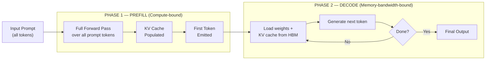
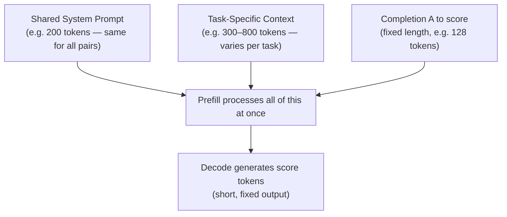
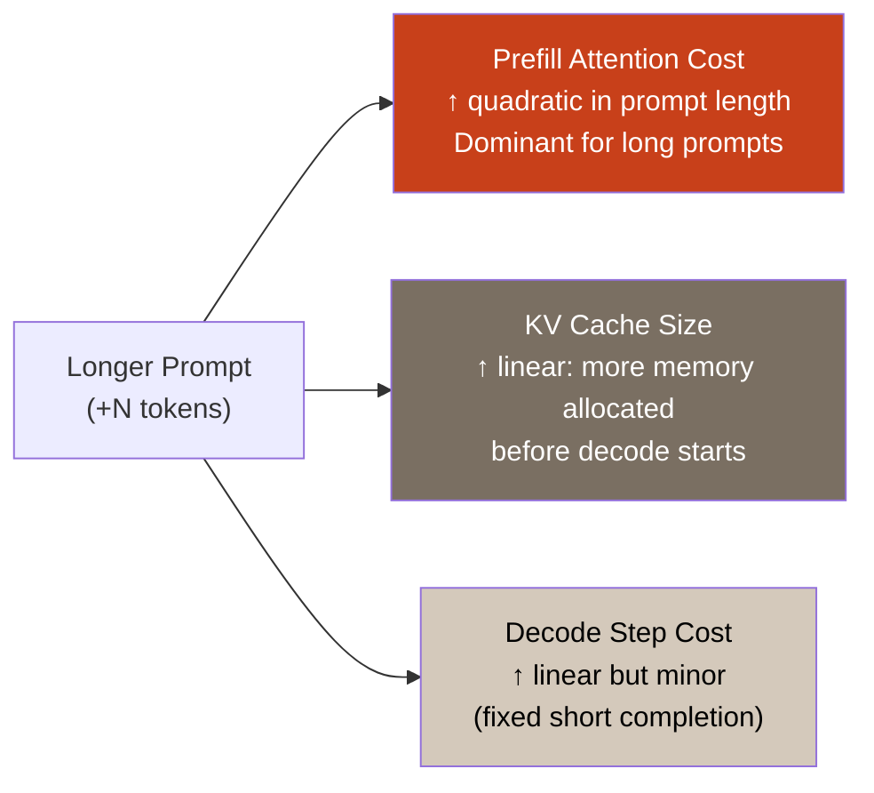
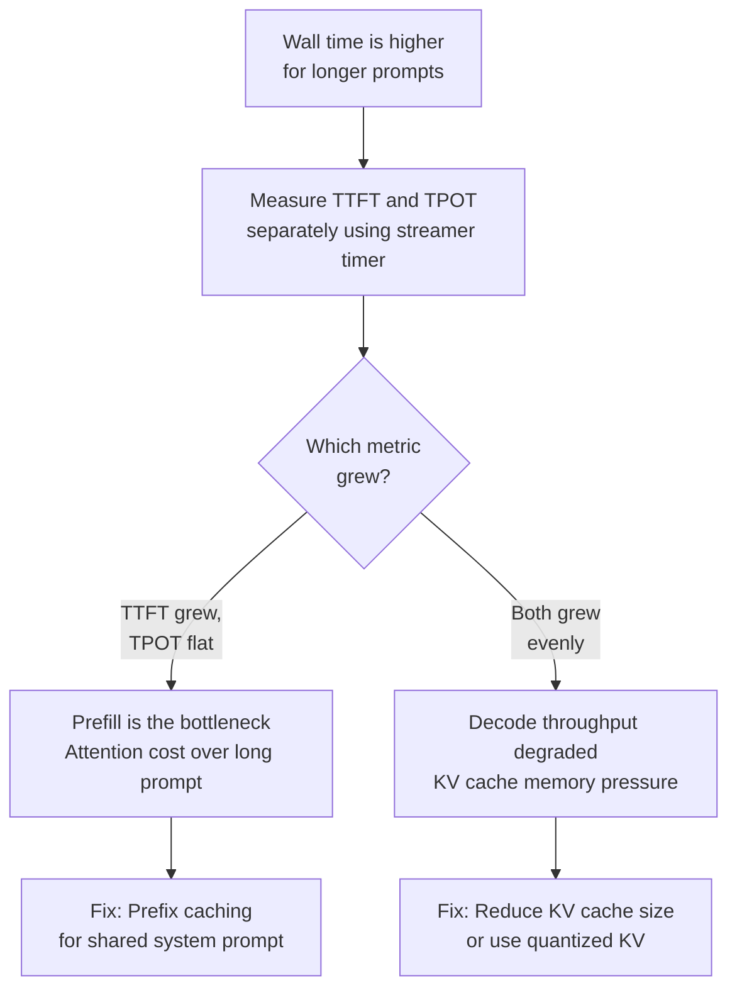

# Asker's Question

For causal LM inference with Hugging Face Transformers-style **`generate()`** on a setup like mine (small instruct model, pairwise preference scoring, **long-ish shared prompt prefix** plus task-specific context), how should I **decompose** measured wall time into prefill vs decode **in practice**—what definitions align with framework internals; what profiling tools or counters (e.g. separate timers around first-token vs subsequent tokens, attention kernel phases) separate them; and **when I increase prompt tokens** (e.g. richer `input_context` in Tenacious-Bench tasks) while holding completion length fixed, does cost shift mostly through **prefill attention cost**, **KV storage size**, or **decode throughput**—and what would I log in a rerun to prove it?

# My Answer: Prefill vs Decode: Profiling Causal LM Inference in Practice

# Prefill vs Decode: Profiling Causal LM Inference in Practice

> **Who this is for:** ML engineers running Hugging Face `generate()` on small instruct models for tasks like pairwise preference scoring — where prompts are long and completion length is fixed.

---

## Core Concepts: What Actually Happens Inside `generate()`

Before instrumenting anything, you need a precise mental model of what the model is doing. Most profiling confusion traces back to treating inference as one monolithic step.

### What Is a Token?

A token is the basic unit a language model works with — roughly a word fragment. "Inference" might be two tokens: `"Infer"` and `"ence"`. When you pass a prompt, it first gets split into tokens, then fed to the model.

### What Is Autoregressive Generation?

Language models are **autoregressive**: they predict one token at a time, each conditioned on everything that came before it. This causal constraint — token *t* can only attend to tokens *1 through t−1* — is what creates the two-phase structure of inference.

```
Prompt:     ["The", "capital", "of", "France", "is"]
Step 1:      → "Paris"
Step 2:      → "."
Step 3:      → <EOS>
```

Each step requires a full forward pass. There is no shortcut.

### What Is the KV Cache?

Every transformer layer computes **Key (K)** and **Value (V)** vectors for each token it sees. During generation, these are expensive to recompute. The **KV cache** stores them after the first pass so subsequent decode steps can reuse them.

Think of it like a notepad: the model writes down its understanding of the prompt once, then reads from that notepad on every subsequent generation step instead of re-reading the entire prompt.

---

## The Two Phases of Inference



### Phase 1: Prefill

**Definition:** Prefill is the single forward pass that processes your entire input prompt at once, computing and storing KV pairs for every prompt token.

**Example:** You send a 600-token prompt (system instruction + task context). In one large parallel computation, the model reads all 600 tokens simultaneously and fills the KV cache. Only then does it produce the first output token.

**Compute characteristics:**
- Dominated by large matrix multiplications across the full sequence
- **Compute-bound**: the GPU is doing math, not waiting on memory
- Attention cost scales roughly **quadratically** with prompt length — doubling your prompt does not double prefill time, it quadruples it
- User-visible as **TTFT (Time to First Token)**: the silent waiting period before streaming begins

### Phase 2: Decode

**Definition:** Decode is the iterative phase where the model generates one token per forward pass, each time reading the full model weights and KV cache from memory.

**Example:** After prefill completes, the model generates token 1 ("Paris"), appends it to the KV cache, then generates token 2 ("."), and so on. Each step is a separate, smaller forward pass.

**Compute characteristics:**
- Each step reads the entire model weights plus the growing KV cache from GPU HBM (High Bandwidth Memory)
- **Memory-bandwidth-bound**: the GPU is waiting on data transfers, not compute
- Cost per step grows **linearly** with current context length (more cached tokens to attend over)
- User-visible as **TPOT (Time per Output Token)**: the streaming speed after the first token

### Key Metrics Defined

| Metric | Full Name | What It Measures | Tied To |
|---|---|---|---|
| **TTFT** | Time to First Token | Latency from request sent → first token received | Prefill phase |
| **TPOT** | Time per Output Token | Average time between consecutive tokens | Decode phase |
| **ITL** | Inter-Token Latency | Time between two specific consecutive tokens | Decode jitter |
| **E2EL** | End-to-End Latency | Total wall time: `TTFT + (TPOT × N tokens)` | Both phases |

---

## Why This Matters for Your Setup

In pairwise preference scoring, your request shape looks like this:



Because completion length is fixed, **any wall-time variation you observe across tasks is almost entirely prefill variation** — driven by how many tokens are in `input_context`.

---

## Profiling: Separating Prefill from Decode Wall Time

Hugging Face `generate()` does not expose phase boundaries natively. The cleanest reconstruction uses a streamer callback to catch first-token emission.

### Pattern A — First-Token Timer (Recommended)

```python
import time
from transformers import AutoModelForCausalLM, AutoTokenizer, TextStreamer

class TimedStreamer(TextStreamer):
    def __init__(self, tokenizer, **kwargs):
        super().__init__(tokenizer, **kwargs)
        self.first_token_time = None
        self.token_count = 0

    def on_finalized_text(self, text: str, stream_end: bool = False):
        if self.first_token_time is None:
            self.first_token_time = time.perf_counter()
        self.token_count += 1
        super().on_finalized_text(text, stream_end)

# --- Run ---
inputs = tokenizer(prompt, return_tensors="pt").to(model.device)
streamer = TimedStreamer(tokenizer)

t0 = time.perf_counter()
model.generate(**inputs, max_new_tokens=128, streamer=streamer)
t1 = time.perf_counter()

ttft   = streamer.first_token_time - t0          # ≈ prefill cost
e2e    = t1 - t0
tpot   = (e2e - ttft) / max(streamer.token_count - 1, 1)

print(f"TTFT  (prefill proxy): {ttft*1000:.1f} ms")
print(f"TPOT  (decode proxy):  {tpot*1000:.1f} ms/tok")
```

**Why this works:** The streamer fires on the first decoded token, which is the exact moment prefill ends. Everything before that timestamp is prefill; everything after is decode.

### Pattern B — GPU Kernel Tracing

For deeper investigation, PyTorch Profiler exposes the actual CUDA kernels:

```python
from torch.profiler import profile, ProfilerActivity

with profile(activities=[ProfilerActivity.CUDA], record_shapes=True) as prof:
    outputs = model.generate(**inputs, max_new_tokens=128)

prof.export_chrome_trace("trace.json")  # open in chrome://tracing
print(prof.key_averages().table(sort_by="cuda_time_total", row_limit=15))
```

In the trace, the **large initial `flash_attn_fwd` kernel** is your prefill attention. It is followed by a repeating pattern of smaller kernels — one cluster per decode step. The phase boundary is visually unmistakable.

---

## What Shifts When You Increase Prompt Tokens

When you add tokens to `input_context` while holding completion length fixed, three effects compound:



**The bottom line:** With a short, fixed completion, a longer prompt shifts cost almost entirely into TTFT. TPOT grows slightly (each decode step must attend over a slightly larger KV cache) but the dominant measurable effect is prefill latency — and it grows faster than linearly once prompts get long.

The hardware reason: each decode step must load `model weights + (context length × KV bytes per token)` from HBM. As context grows, this data volume increases, and throughput degrades — but for 128-token completions over a 1024-token prompt, this effect is small compared to prefill.

---

## What to Log in a Rerun to Prove It

```python
import json, time

def run_and_log(model, tokenizer, prompt: str, max_new_tokens: int = 128) -> dict:
    inputs = tokenizer(prompt, return_tensors="pt").to(model.device)
    prompt_tokens = inputs["input_ids"].shape[-1]

    streamer = TimedStreamer(tokenizer)
    t0 = time.perf_counter()
    model.generate(**inputs, max_new_tokens=max_new_tokens, streamer=streamer)
    t1 = time.perf_counter()

    ttft  = streamer.first_token_time - t0
    e2e   = t1 - t0
    n_out = streamer.token_count
    tpot  = (e2e - ttft) / max(n_out - 1, 1)

    record = {
        "prompt_tokens":     prompt_tokens,     # independent variable
        "completion_tokens": n_out,             # hold this constant
        "ttft_ms":           round(ttft * 1000, 2),
        "tpot_ms":           round(tpot * 1000, 2),
        "e2e_ms":            round(e2e  * 1000, 2),
        "model":             model.config._name_or_path,
    }
    print(json.dumps(record))
    return record
```

Run your Tenacious-Bench tasks at **three or more prompt lengths** (e.g. 256 / 512 / 1024 / 2048 tokens), holding `max_new_tokens` fixed. Then plot:

| What to Plot | What It Proves |
|---|---|
| `ttft_ms` vs `prompt_tokens` | Curve bending upward faster than linear → prefill attention is the dominant cost |
| `tpot_ms` vs `prompt_tokens` | Nearly flat → decode throughput is not the bottleneck |
| `ttft_ms / e2e_ms` ratio | Approaches 1.0 as prompts grow → prefill dominates the budget |

---

## Practical Fix: Prefix Caching

Once profiling confirms prefill is the bottleneck, the highest-leverage optimization for your setup is **prefix caching**: compute the KV cache for the shared system prompt once and reuse it across all tasks.

```python
# Step 1: prefill the shared prefix once
shared_prefix = tokenizer(system_prompt, return_tensors="pt").to(model.device)
with torch.no_grad():
    prefix_outputs = model(**shared_prefix, use_cache=True)
    cached_kv = prefix_outputs.past_key_values   # KV cache for shared prefix

# Step 2: for each task, only prefill the task-specific context
task_inputs = tokenizer(task_context, return_tensors="pt").to(model.device)
outputs = model.generate(
    **task_inputs,
    past_key_values=cached_kv,   # skip re-prefilling the shared prefix
    max_new_tokens=128,
)
```

This converts repeated quadratic prefill cost into a single amortized payment — the single most impactful change for high-volume preference scoring workloads with a shared system prompt.

---

## Summary



**The one-line answer:** In a fixed-completion preference scoring setup, increasing prompt tokens shifts cost through prefill attention quadratically. Log `prompt_tokens`, `ttft_ms`, and `tpot_ms` on every run. If TTFT scales super-linearly with prompt length while TPOT stays flat, you have your proof — and prefix caching is your fix.

---

**Sources**: 
* [Mastering LLM Inference — GPU Fundamentals](https://medium.com/@vamshire/mastering-llm-inference-a-deep-dive-into-gpu-fundamentals-d50e990c6e36) 
* [LLM Inference Benchmarking](https://www.digitalocean.com/blog/llm-inference-benchmarking) 
* [DistServe: Prefill–Decode Introduction](https://adityashrishpuranik.com/writing/dist-serve-1-prefill-decode-introduction)