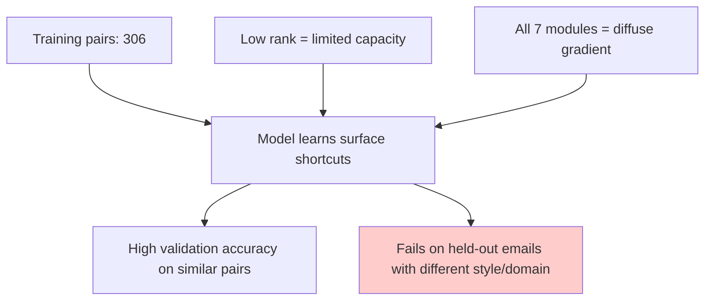

# Understanding LoRA Configuration for Preference Critics: Beyond the Defaults

## The Problem

You've trained a LoRA adapter to classify B2B sales emails against a rubric using Unsloth's defaults (rank 16, alpha 32, all projection layers). The model shows high validation accuracy but poor held-out reranking performance. The core question: **is this a configuration problem or something else?**

Let's build the mechanical understanding you need to answer that question.

---

## What LoRA Actually Changes Inside the Transformer

### The Core Mechanism

LoRA (Low-Rank Adaptation) freezes the pretrained weight matrix **W** and learns a low-rank update:

```
W' = W + BA
```

Where:
- **B** is *d* × *r* (down-projection)
- **A** is *r* × *k* (up-projection)  
- **r** << min(*d*, *k*) is the rank

Instead of updating millions of parameters in **W**, you learn only *r* × (*d* + *k*) parameters. For a 4096 → 4096 projection with r=16, that's ~131k parameters instead of 16.7M.

### Which Matrices Get Adapted

In a transformer decoder block, there are **seven** projection matrices:

**Attention (4 projections):**
```
Q = W_q × hidden_states  # Query projection
K = W_k × hidden_states  # Key projection  
V = W_v × hidden_states  # Value projection
O = attention_out × W_o  # Output projection
```

**MLP (3 projections):**
```
up   = W_up × hidden_states    # Gate/up (often fused)
gate = W_gate × hidden_states  # Activation gate
down = intermediate × W_down   # Down projection
```

Unsloth's default applies LoRA to **all seven**. But do you need all of them?

---

## What Each Module Does (and What Matters for Your Task)

### Attention Projections: Pattern Matching

**Q, K, V** control *what the model attends to*. For a rubric critic:
- **Does the email open with a value proposition?** (positional + semantic pattern)
- **Does it avoid generic claims?** (lexical + contextual pattern)

These are **retrieval-like operations**—the model needs to recognize specific linguistic patterns and weigh them.

**W_o** (output projection) blends multi-head outputs and often encodes "what this pattern means downstream."

**Practical implication:** If your rubric checks for *surface features* (length, keyword presence, structure), attention projections matter. If it evaluates *deeper semantics* ("does this sound credible?"), MLP projections may matter more.

### MLP Projections: Feature Transformation

The MLP is a two-layer feedforward network that acts as a **key-value memory**:
- **W_up / W_gate** lift the representation into a higher-dimensional space where non-linear features are computed
- **W_down** projects back, often encoding "feature X implies decision Y"

For preference learning, MLPs often encode the **decision boundary**—e.g., "emails with vague ROI claims rank lower than those with specific metrics."

**Practical implication:** If your rubric is about *relationships between features* (credibility = specificity + authority signals), MLPs are critical.

---

## The Rank Bottleneck: What r=16 Actually Limits

### Intrinsic Rank and Expressiveness

The LoRA paper (Hu et al., 2021) found that many fine-tuning tasks have **low intrinsic rank**—the weight updates lie in a low-dimensional subspace. They showed r=1 to r=8 often suffices for downstream NLP tasks.

But **preference learning is different**:
- You're not adding a single new skill (like "summarize in French")
- You're learning a **multi-dimensional decision boundary** across rubric criteria

With 306 preference pairs and ~10 rubric dimensions, you're asking the model to learn:
1. Which patterns correlate with each criterion
2. How to weight/combine criteria into a binary pass/fail decision

### What r=16 Can and Cannot Learn

Each LoRA-adapted matrix can learn **r independent directions** of update. For r=16:

✅ **Can learn:**
- 16 distinct "feature detectors" per layer (e.g., "has specific numbers," "uses passive voice," "mentions competitor")
- Simple linear combinations of these features

❌ **Cannot learn:**
- Complex interactions between >16 features
- Criterion-specific weighting (if rubric has >16 dimensions and they don't compress neatly)

**Diagnostic question:** Does your rubric have orthogonal criteria that can't be linearly combined? If yes, r=16 may be too low.

---

## Why High Validation Accuracy but Poor Reranking?

This is a **classic overfitting-to-distribution signal**. Here's the likely failure mode:



### Hypothesis 1: Shortcut Learning
With only 306 pairs, the model might learn **spurious correlations**:
- Training emails that pass use "increase revenue by X%"
- Model learns "presence of percentage → pass" instead of "specific, credible ROI claim → pass"

Low rank **accelerates** this because the model has limited capacity to encode nuanced rules.

### Hypothesis 2: Gradient Diffusion
Spreading LoRA across all 7 modules with 306 pairs means **~44 examples per module** (ignoring batching). Each module gets weak supervision.

**Better approach:** Concentrate rank budget on modules that matter most.

---

## A Defensible Configuration Strategy

### Step 1: Module Selection Experiment

Test three configurations on your 306 pairs:

```python
# Config A: Attention-only (hypothesis: rubric = pattern matching)
target_modules = ["q_proj", "k_proj", "v_proj", "o_proj"]
lora_rank = 32  # double the rank, halve the modules

# Config B: MLP-only (hypothesis: rubric = decision boundary)
target_modules = ["up_proj", "gate_proj", "down_proj"]  
lora_rank = 32

# Config C: Hybrid (hypothesis: both matter, but imbalanced)
target_modules = {
    "q_proj": 8, "k_proj": 8, "v_proj": 16, "o_proj": 8,  # 40 total
    "down_proj": 24  # MLP decision layer gets most capacity
}
```

**Metric to watch:** Not just validation accuracy—measure **held-out reranking Kendall's τ** or **regret@k** (how often the top-k by score contains the true positive).

### Step 2: Rank Ablation

For the winning module set, test r ∈ {8, 16, 32, 64}. You're looking for the **elbow**:
- r=8 may be too weak (high bias)
- r=64 may overfit with 306 pairs (high variance)

**Rule of thumb:** For preference learning, you want `r × num_modules × num_layers ≈ 2× num_rubric_criteria × num_training_pairs / 10`. For you: r × modules × layers ≈ 2 × 10 × 306 / 10 ≈ 600 parameters per criterion-pair cluster. With 32 layers and 4 modules, that suggests r ≈ 5–10 (very aggressive) or r=16–32 with fewer modules.

### Step 3: Diagnostic Probe

Add this after training:

```python
# Extract LoRA weight norms per module
for name, module in model.named_modules():
    if isinstance(module, LoraLayer):
        lora_A_norm = module.lora_A.weight.norm().item()
        lora_B_norm = module.lora_B.weight.norm().item()
        print(f"{name}: ||A||={lora_A_norm:.3f}, ||B||={lora_B_norm:.3f}")
```

**Interpretation:**
- Modules with **very low norms** didn't learn anything useful (wasted capacity)
- Modules with **very high norms** may be overfitting or compensating for frozen layers

---

## Practical Recommendations

### Immediate Next Steps

1. **Reduce modules, increase rank:**  
   Try `target_modules=["v_proj", "down_proj"]` with `r=32`. This focuses capacity on value retrieval (attention) and decision logic (MLP).

2. **Check for data leakage:**  
   Are validation emails from the same senders/campaigns as training? If yes, your high validation accuracy is meaningless.

3. **Add regularization:**  
   Use `lora_dropout=0.1` to reduce overfitting on 306 pairs.

4. **Inspect failure cases:**  
   Manually review emails where reranking failed. Are they stylistically different? Do they violate rubric criteria the training set didn't cover?

### Code Snippet: Focused LoRA Config

```python
from peft import LoraConfig, get_peft_model

config = LoraConfig(
    r=32,  # doubled from default
    lora_alpha=64,  # keep alpha = 2r for stable scaling
    target_modules=["v_proj", "down_proj"],  # attention + MLP decision
    lora_dropout=0.1,
    bias="none",
    task_type="CAUSAL_LM"
)

model = get_peft_model(base_model, config)
print(f"Trainable params: {model.print_trainable_parameters()}")
```

### When to Keep r=16 on All Modules

The Unsloth default **is** defensible if:
- Your rubric is **highly compositional** (many interacting criteria)
- You have **>1000 preference pairs** (enough supervision per module)
- Validation and test distributions are **identical** (then high val accuracy = high test accuracy)

For 306 pairs with distribution shift, you need **concentrated, regularized capacity**.

---

## The Mechanistic Takeaway

LoRA rank controls **how many independent directions** your adapter can learn in weight space. For a rubric critic:
- **Attention projections** learn *what patterns to look for*
- **MLP projections** learn *how to combine patterns into decisions*
- **Rank** limits *how many distinct patterns/rules* fit in the adapter

Your r=16 × 7 modules config gave the model 112 degrees of freedom per layer—but spread thin across 7 matrices. With only 306 training pairs, the model likely learned shallow shortcuts that validated well but didn't generalize.

**The fix isn't just "use different numbers"—it's understanding which parts of the network encode which parts of your rubric, then allocating rank accordingly.**